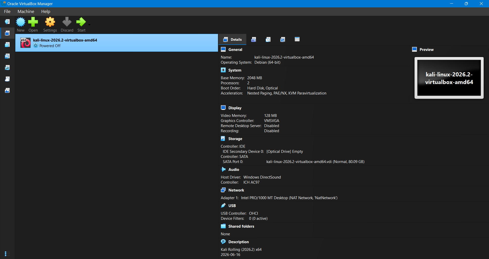
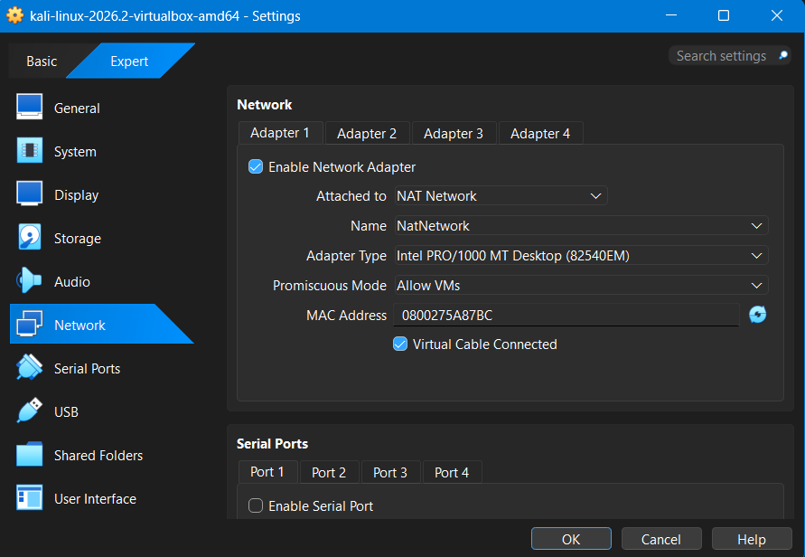
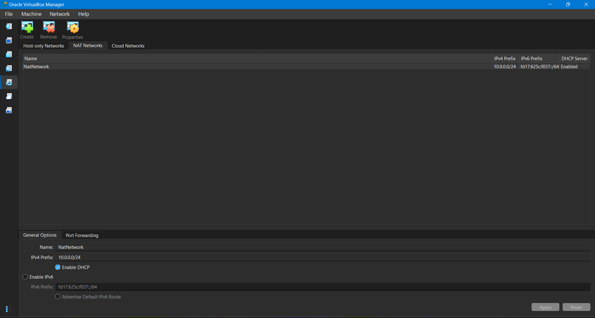

# 🔐 Cybersecurity Lab Setup

A hands-on cybersecurity lab environment built using **Oracle VirtualBox and Kali Linux**.
The purpose of this project is to create an isolated and controlled virtual networking environment that can later be expanded for cybersecurity learning, network analysis, penetration-testing practice, and security experimentation.

---

## 🎯 Project Objective

The objective of this project is to build a **controlled cybersecurity laboratory environment** using virtualization.

The lab is designed around:

* 🐧 Kali Linux as the primary security-testing environment
* 🖥️ Oracle VirtualBox for virtualization
* 🌐 A dedicated NAT Network for virtual machines
* 🔒 An isolated `10.0.0.0/24` private network
* 🧪 A foundation for future cybersecurity experiments

This setup provides a safe environment where additional virtual machines can be added and tested without directly exposing them to the physical network.

---

## 🏗️ Lab Architecture

```text
                    Host Machine
                         │
                         ▼
                 Oracle VirtualBox
                         │
                         ▼
                   NAT Network
                   10.0.0.0/24
                         │
                ┌────────┴────────┐
                │                 │
                ▼                 ▼
          Kali Linux          Future VMs
        Security Machine       / Targets
```

The current environment contains a Kali Linux virtual machine connected to a dedicated NAT Network named `NatNetwork`.

The network uses the private IPv4 range:

```text
10.0.0.0/24
```

---

## 🛠️ Technologies Used

| Technology            | Purpose                                  |
| --------------------- | ---------------------------------------- |
| **Oracle VirtualBox** | Virtualization platform                  |
| **Kali Linux**        | Cybersecurity testing environment        |
| **NAT Network**       | Isolated virtual network                 |
| **IPv4**              | Private network addressing               |
| **Virtual Machines**  | Controlled cybersecurity lab environment |

---

# ⚙️ Environment Configuration

## 1. Kali Linux Virtual Machine

A Kali Linux virtual machine was configured inside Oracle VirtualBox.

### VM Configuration

* **Operating System:** Debian (64-bit)
* **Memory:** 2048 MB
* **Processors:** 2
* **Storage:** ~80 GB
* **Graphics Memory:** 128 MB
* **Network Adapter:** Intel PRO/1000 MT Desktop
* **Network Mode:** NAT Network



The VM serves as the primary machine for cybersecurity-related experimentation within the lab.

---

## 2. Network Adapter Configuration

The Kali Linux VM was connected to a dedicated **NAT Network** rather than using a standard NAT configuration.

### Network Configuration

```text
Attached to:       NAT Network
Network Name:      NatNetwork
Adapter Type:      Intel PRO/1000 MT Desktop
Promiscuous Mode:  Allow VMs
Virtual Cable:     Connected
```



Using a NAT Network provides a suitable foundation for connecting multiple virtual machines to the same private virtual network.

---

## 3. NAT Network Configuration

A dedicated NAT Network named `NatNetwork` was created in VirtualBox.

### Network Details

```text
Network Name:   NatNetwork
IPv4 Network:   10.0.0.0/24
DHCP:           Enabled
IPv6:           Disabled
```



The `10.0.0.0/24` private network provides a dedicated address space for the virtual laboratory.

This allows the environment to be expanded later by adding additional machines such as vulnerable Linux systems, Windows machines, or intentionally vulnerable applications.

---

# 🔒 Why NAT Network?

A NAT Network was selected because it provides a useful balance between **connectivity and isolation**.

Unlike simply connecting a VM directly to the physical network, the virtual machines can operate inside a dedicated private network.

This makes the configuration suitable for building a cybersecurity practice environment where multiple machines can eventually communicate with one another.

### Intended Structure

```text
             Internet
                 │
                 │
          Host Computer
                 │
        ┌────────┴────────┐
        │ Oracle VirtualBox│
        └────────┬────────┘
                 │
          NAT Network
          10.0.0.0/24
                 │
       ┌─────────┴─────────┐
       │                   │
   Kali Linux          Target VM
   Security VM        Future Addition
```

---

# 🧪 Current Lab Status

| Component                   | Status          |
| --------------------------- | --------------- |
| Oracle VirtualBox           | ✅ Configured    |
| Kali Linux VM               | ✅ Configured    |
| VM Resources                | ✅ Configured    |
| NAT Network                 | ✅ Configured    |
| Private IPv4 Network        | ✅ `10.0.0.0/24` |
| DHCP                        | ✅ Enabled       |
| VM → NAT Network Connection | ✅ Configured    |
| Additional Target VMs       | 🔄 Planned      |

---

# 🚀 Future Expansion

This setup is intended to serve as the foundation for a larger cybersecurity laboratory.

Planned additions include:

* 🖥️ Vulnerable Linux target machines
* 🪟 Windows virtual machine
* 🔍 Network reconnaissance and scanning
* 📡 Wireshark packet analysis
* 🛡️ Vulnerability assessment
* 🌐 Web application security testing
* 🔐 Active Directory security lab
* 📊 Security monitoring and log analysis
* 🚨 SIEM experimentation
* 🧪 Controlled penetration-testing exercises

The lab will gradually evolve from a basic virtual networking environment into a **multi-machine cybersecurity testing laboratory**.

---

# 📚 What I Learned

Building this environment helped strengthen my practical understanding of:

* Virtual machine configuration
* Virtual networking
* NAT vs. NAT Network
* Private IPv4 addressing
* Network isolation
* DHCP
* Virtual network adapters
* Designing an expandable cybersecurity lab

More importantly, the project provides a practical foundation for learning cybersecurity concepts in a controlled environment rather than relying only on theoretical knowledge.

---

# ⚠️ Disclaimer

This laboratory is intended **strictly for educational purposes and authorized security testing**.

Any scanning, exploitation, penetration testing, or other security activity should only be performed against systems for which you have explicit permission.

---

# 👨‍💻 Author

**Pranav Aggarwal**

Cybersecurity • Networking • GRC • SQL

This project is part of my ongoing hands-on cybersecurity learning journey.

---

⭐ **More components and experiments will be added to this lab as the project develops.**

